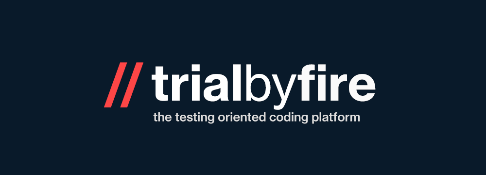

# Introduction
Welcome to the TestOfFire! We are the world's first *test-oriented coding platform*. We help engineers of all backgrounds practice solid testing techniques that they can carry on for the rest of their career.

Our mission is to bring testing back into the limelight, so that the whole world can benefit from robust, elegant, and errorless code.

# Inspiration
"Sometimes you need to fail". And in the field of Computer Science, writing, failing, and iterating on test cases is one of the best ways to ensure your code is resilient to errors and bugs. But even though testing is one of the most integral aspects of Software Engineering, it simply lacks the prestige and acclaim of other parts of the field such as algorithmic development, full-stack architecture, and systems-reliability engineering. Just take a look at how many resources there are to help students and job-seekers learn and practice algorithms!

# Market
This product is intended to be used by students looking to learn testing techniques for the first time, job seekers looking to practice before their next whiteboarding interview, senior engineers looking for a quick refresher in basic testing techniques, and tech companies looking to interview and/or train their prospective employees.

# How it works
Log on to our platform and pick a problem to start with.

Think about the algorithm and the potential functional, boundary, and edge cases that you might want to write.

Start writing your test cases in Python as simple instance methods ex. def test_this(self): ...

Submit your test cases when you're ready.

Receive detailed feedback about whether your test cases are wrong, incomplete, or pass our platform!

Track your progress on your dashboard.

Your code is persisted to *Firebase* in realtime, so you'll never lose your progress!

# In the future
- Adding hundreds of problems (content)
- System-oriented sandboxing with Docker (dev)
- Support for multiple languages (dev)
- Moving data to Postgres (dev)